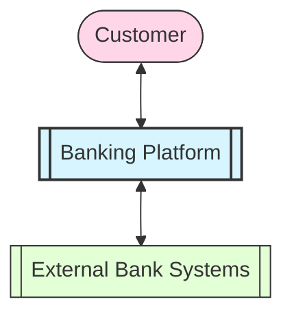
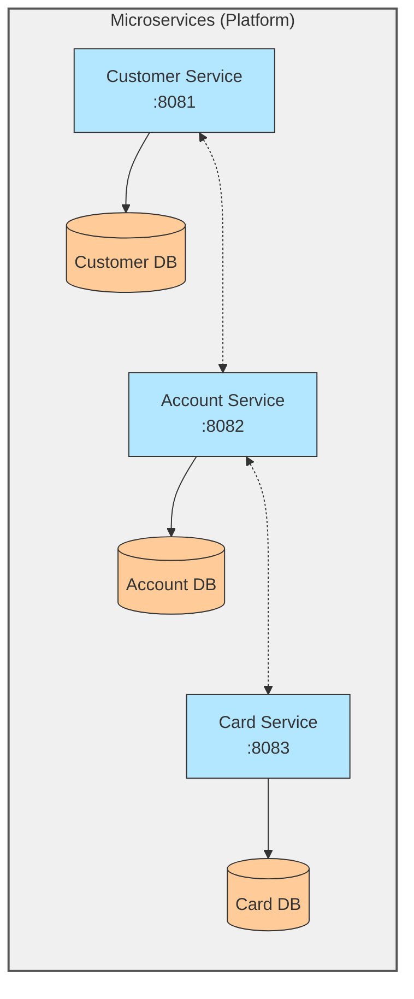

I understand your frustration. Here's the complete README.md file as a single, continuous block with no breaks between sections:

````markdown
# 🏦 DTB Banking Platform Technical Test

A modular banking platform enabling customers to access card services through three core microservices.

## 📊 Data Flow Diagrams

### Level 0 DFD (Context Diagram)


````

### Level 1 DFD (Microservices Breakdown)



## 📦 Services

| Service  | Port | Swagger UI                                    | Description                          |
| -------- | ---- | --------------------------------------------- | ------------------------------------ |
| Customer | 8081 | http://localhost:8081/swagger-ui/index.html#/ | Manages customer profiles and data   |
| Account  | 8082 | http://localhost:8082/swagger-ui/index.html#/ | Handles accounts and transactions    |
| Card     | 8083 | http://localhost:8083/swagger-ui/index.html#/ | Manages card issuance and operations |

## 🚀 Getting Started

### Prerequisites

- Java 17+
- Maven 3.8+
- Docker (optional)

### Installation

## `Build and Run Project`

> Requires **JDK 21** to run the project, **Git** to pull from remote repository, and **Docker** to run docker-compose

Follow the steps to build and run the project:

- Clone the repository from Git

```bash
  git clone git clone https://github.com/AmosMbeki/DTBBankingPlatformTechnicalTest.git
```

- Open the project file

```shell
  cd DTBBankingPlatformTechnicalTest
```

- Run the project with Docker

```shell
  docker-compose up -d && docker-compose down
```

<!-- ## 🧪 Testing
```bash
mvn test
``` -->

## 🤝 Contributing

1. Fork the repository
2. Create your feature branch
3. Commit your changes
4. Push to the branch
5. Open a Pull Request

```

```
